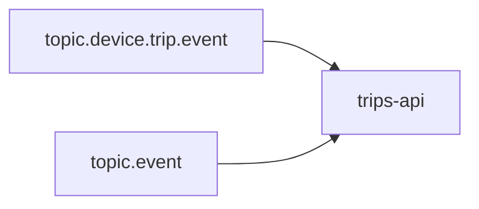

# trips-api



Trip opening:
```
{
  …,
  data: {
    id: "2XUPU7gd9TWnkwXLH6MuzxTMnCD",
    deviceId: "2XUPU7gd9TWnkwXLH6MuzxTMnCD",
    completed: false
    start: {
      time: "2023-10-30T09:22:21Z"
    }
  }
}
```

### Migrations

```
goose -dir migrations create <migration_name> sql
```

GitHub? Hello?
